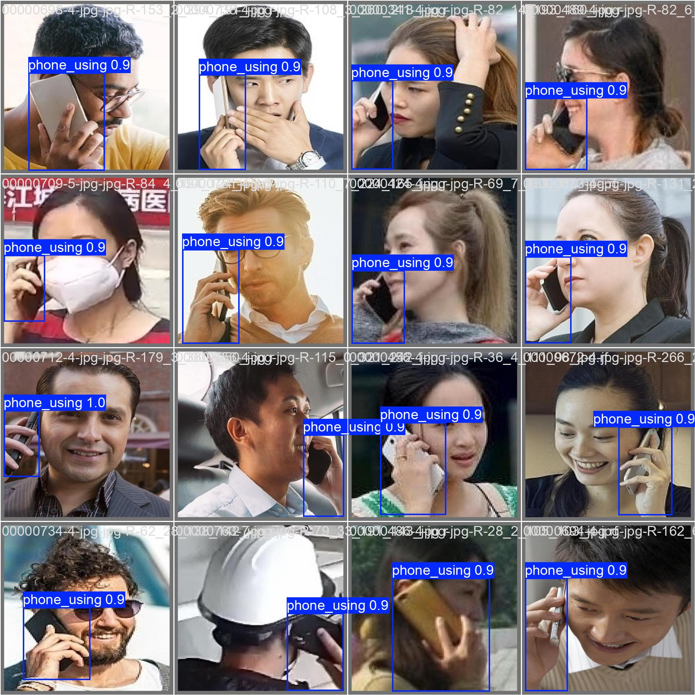
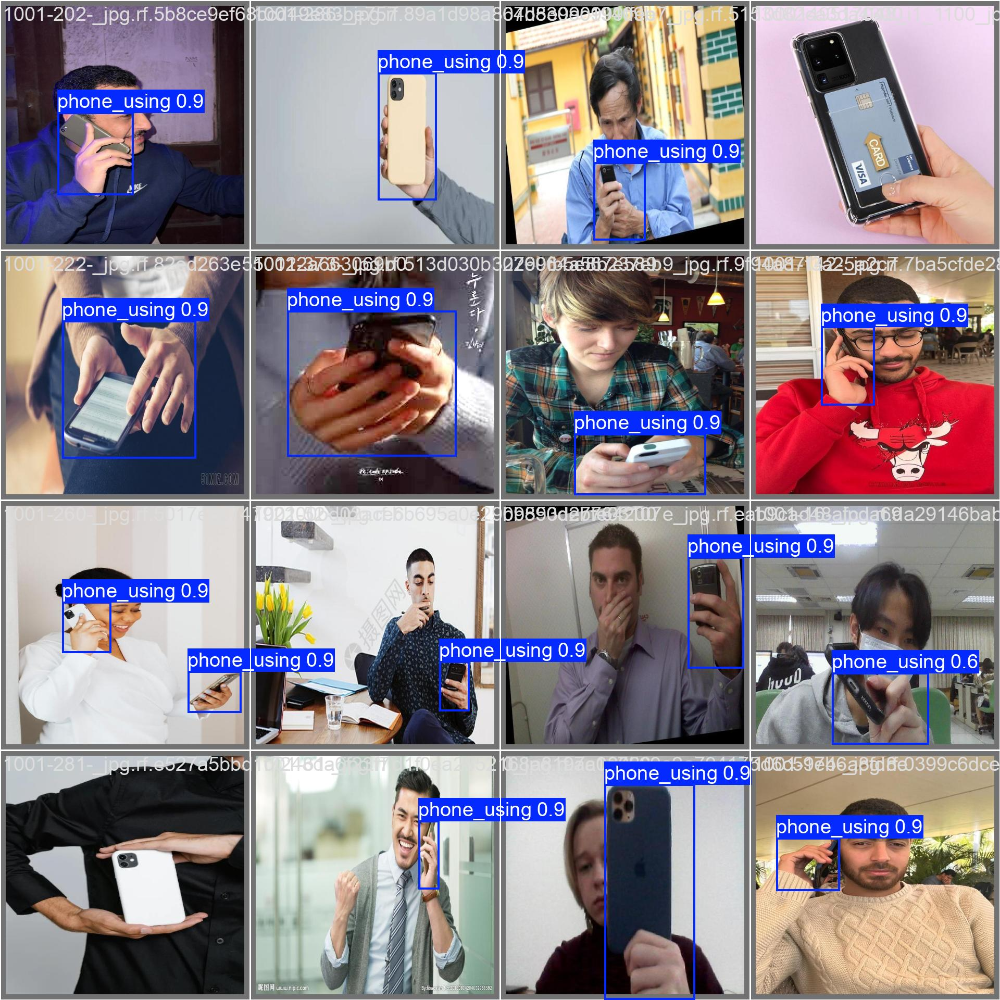

# Mobile Phone Detection (YOLO / Ultralytics)

End-to-end scripts for training, evaluating, and running inference for **mobile phone / phone-usage detection** using **Ultralytics YOLO**. Includes:

- Training (`train.py`) and test-set evaluation (`test.py`)
- Batch image inference + YOLO-label export (`prediction.py`)
- 2-stage pipeline: **person detector → crop → phone-usage detector** (`pipeline_test.py`)
- Dataset analysis utilities (`analysis/analysis.py`)
- Simple FastAPI demo (`webapp.py`)

## Requirements

- Python 3.10+ recommended (some deps may not support very new Python versions).
- PyTorch (install the correct build for your CUDA/CPU first).

Install Python deps:

```bash
pip install -r requirements.txt
```

## Quickstart

### 1) Train

`train.py` is a thin wrapper around `ultralytics.YOLO(...).train()` and supports passing a hyperparameter YAML (`config/hyp.yaml` by default).

```bash
python3 train.py \
  --data /path/to/data.yaml \
  --weights yolo11s.pt \
  --device 0 \
  --epochs 200 \
  --batch 16 \
  --imgsz 640 \
  --name exp1
```

Notes:
- Use `--scratch` to train from a model YAML (no pretrained weights).
- Use `--auto_name --name_prefix train` to auto-increment run names under `--project` (default `runs/train`).

### 2) Evaluate on test split

`test.py` runs `model.val(split="test")` and writes a small `test_metrics.json` to the run directory.

```bash
python3 test.py \
  --weights runs/train/exp1/weights/best.pt \
  --data /path/to/data.yaml \
  --device 0 \
  --plots
```

### 3) Batch inference on images (optional: export YOLO txt)

`prediction.py` runs inference over a single image or a folder of images and can write YOLO-format `.txt` labels.

```bash
python3 prediction.py \
  --weights runs/train/exp1/weights/best.pt \
  --source /path/to/images \
  --out ./labels \
  --conf 0.25 \
  --recursive
```

### 4) 2-stage pipeline (person → crop → phone usage)

`pipeline_test.py` supports `--mode image` and `--mode video` and produces annotated outputs (and optionally crops/JSON/YOLO labels).

Image mode:

```bash
python3 pipeline_test.py \
  --mode image \
  --source /path/to/images \
  --recursive \
  --person-weights yolov9m.pt \
  --phone-weights runs/train/exp1/weights/best.pt \
  --device 0 \
  --draw-phone-box \
  --save-crops \
  --export-json \
  --export-yolo-phone --yolo-phone-class 0 \
  --outdir ./runs/pipeline
```

Video mode:

```bash
python3 pipeline_test.py \
  --mode video \
  --source /path/to/video.mp4 \
  --person-weights yolov9c.pt \
  --phone-weights runs/train/exp1/weights/best.pt \
  --device 0 \
  --save-crops \
  --save-video ./runs/video/annotated.mp4 \
  --outdir ./runs/video
```

RTSP mode (same as video mode):

```bash
python3 pipeline_test.py \
  --mode video \
  --source "rtsp://user:pass@ip:554/Streaming/Channels/101" \
  --person-weights yolov9c.pt \
  --phone-weights runs/train/exp1/weights/best.pt \
  --device 0 \
  --show \
  --outdir ./runs/video
```

## Web demo (FastAPI)

`webapp.py` is a small upload-and-infer demo that renders results via `templates/index.html`.

1) Update the weights path used by the app:
   - `webapp.py` currently uses `DEFAULT_WEIGHTS = Path(".../best.pt")` with an **absolute path**.
2) Run:

```bash
uvicorn webapp:app --host 0.0.0.0 --port 8000
```

Then open `http://localhost:8000`.

## Dataset analysis

`analysis/analysis.py` scans YOLO datasets (`train/val/test`) and exports plots + a JSON report.

```bash
python3 analysis/analysis.py \
  --root /path/to/dataset_root \
  --outdir ./analysis/out \
  --img-exts .jpg .jpeg .png \
  --sample-vis 40
```

## Utilities

The `utils/` folder contains small helpers for dataset preparation (splitting, converting CSV→YOLO, cropping, visualization, etc.).

- `utils/download_data.py` downloads a dataset via `kagglehub` (requires Kaggle credentials and will copy into this repo).

## Notes

- Several `.sh` scripts (and some defaults in `.py`) use hardcoded absolute paths; treat them as examples and adjust paths for your machine.
- `pipeline_test_rtsp.sh` references `pipeline_phone_use.py` (not present); use `pipeline_test.py` instead.
- Pretrained `.pt` weights are present in the repo root (e.g. `yolo11n.pt`, `yolov9m.pt`) for convenience.

## Demo

<table>
  <tr>
    <td></td>
    <td></td>
  </tr>
</table>

